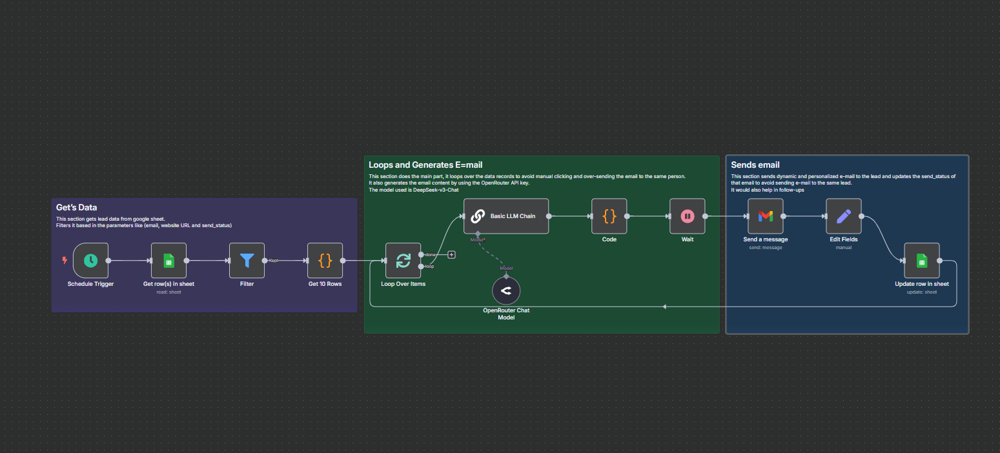
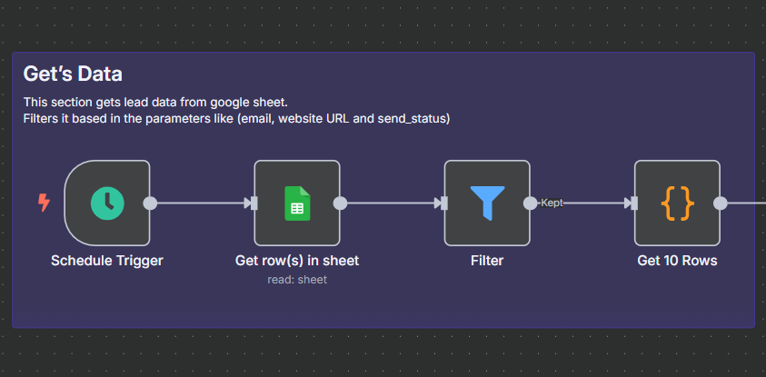
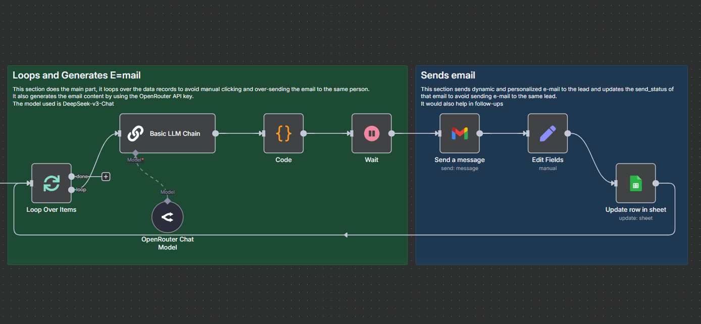

# n8n-Cold_Email_System
**AI-Powered Cold Email Outreach System**  
This project showcases an end-to-end cold outreach system built using AI and automation tools. Designed as part of my client lead generation portfolio, this system automatically generates and sends personalized cold emails to potential clients — fully integrated and scalable.

### **Objective**

The primary objective was to create a fully automated cold outreach system to help service providers (like real estate agents) reach potential clients with highly personalized messages — increasing open rates, replies, and deals closed.

### **System Architecture**

The system is designed using modular automation layers and intelligent AI logic. It includes:

1. **Data Input**: A Google Sheet with lead details (first name, company, city, etc.).
2. **AI Content Generation**: An OpenRouter API call to generate custom cold emails using DeepSeek LLM.
3. **Automation Engine**: An n8n workflow to manage email creation, sending, and tracking.
4. **Email Delivery**: Automated sending through Gmail.
5. **Status Tracking**: Updates the Google Sheet with a “sent” status after each email is delivered.

### Key Features

This project involves:

- **Lead Data Integration**
    
    Dynamically pulls lead data from Google Sheets — includes first name, company, city, and more for use in prompts.
    
- **Prompt Engineering for Cold Emails**
    
    Custom-crafted prompt inside n8n's LLM node to generate personalized email subjects and 3-part body using DeepSeek LLM.
    
- **AI Email Generation**
    - Personalized subject line
    - Custom intro referencing their city or company
    - Value-driven body
    - Strong call-to-action
- **Gmail Integration**
    
    Sends emails directly via Gmail with full automation.
    
- **Status Tracking & Error Handling**
    
    After each email is sent, the system writes “sent” in the Google Sheet. Failed attempts are logged.
    

### Workflow Example

- Google Sheet:
- Output Email:
    
    **Subject**: Helping Luxe Realty stand out in New York
    
    **Body**:
    
    Hi Sarah,
    
    Just saw your listings in New York — very impressive!
    
    I'm Rizwan Khan, and I help agents like you get exclusive leads through automated AI outreach...
    
    [rest of the email]
    
- Status in Sheet:

### **Skills Demonstrated**

- AI Automation Engineering
- Prompt Engineering (for LLMs)
- n8n Workflow Development
- Google Sheets + Gmail Integration
- Lead Generation Automation
- Cold Email Strategy & Copywriting

### **Tech Stack**

- **n8n** (self-hosted) – automation workflows
- **OpenRouter API** – LLM for generating personalized emails
- **Gmail API** – for automated sending
- **Google Sheets** – lead data source & tracking
- **DeepSeek LLM** – for high-quality AI-written message

Note:
You can email me on rizwanforbuisness@gmail.com to get the tempelate for FREE.

Regards,

Rizwan Bin Akbar
